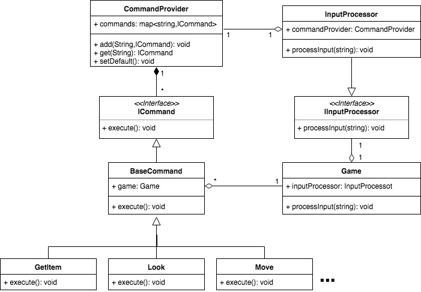
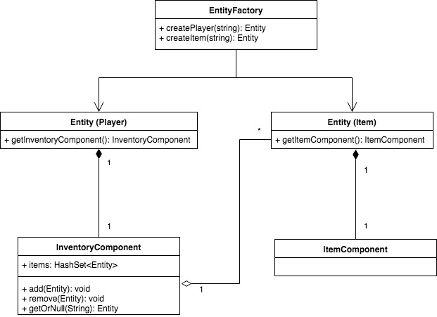

# Pocket Gems Challenge
## New Features
  - **Inventory**: Player can create, grab, hold and drop items.

## Implementation Details
### Refactor
In order to simplify the implementation of the inventory feature, and future new features, the following changes were
made in the previous code.
#### Commands
I followed a Command design pattern approach, in order to implement each of the commands. In this way each command is
contained in a single class that implements a command interface.
Doing this, new commands are easier to implement, and previous commands are easier to maintain, modify and test.
The most important components are:
 - **ICommand**: Interface that contains an execute method to execute the command.
 - **BaseCommand**: Abstract command that contains some common logic and helpers for specific commands.
 - **SpecificCommans**: These are all the commands we have in the game.
 - **CommandProvider**: Provides commands for specific inputs. This is the place where each input is defined. This
 gives flexibility in order to configure different inputs.
 - **IInputProcessor**: Interface to process an input. This was created to decouple the dependencies from some commands
 with actual InputProcessor.
 - **InputProcessor**: It proccess the input. Logic of each command was removed from here, and a CommandProvider is now
 injected in order to trigger specific commands.
 - **CommandNotFoundException**: Exception thrown when a command was not found by the CommandProvider.

#### Design Diagram

### Inventory Feature
#### New Components
 - **InventoryComponent**: Component that contains a collection of entities. Implemented with a list because I'm
 assuming that we won't have a huge ammount of items so O(N) is affordable. The collection implementation is private,
 so change it to a hash map is easy and won't affect the rest of the code.
 - **ItemComponent**: Component that represents an item. It is empty so we can easely add features or properties to it.
 It is also used to identify if an entity is an item (or conatins an item).
 - **GetItem**: Command to grab an item and add it in the inventory. Here I'm ussiming that a player cannot grab an
 item from a room different than the actual one.
 - **DropItem**: Command to drop an item in the player current room.
 - **ShowInventory**: Command to show the current items in the inventory.

#### Changes in Previous Components
 - **Entity**: Added methods to get Item and Inventory components.
 - **EntityFactory**: Added methods to create an Item component. Adding an empty inventory to each new player entity.

#### Design Diagram

### Other Changes
- **Main**: It creates and perform the initial configuration of the dependencies we need.
- **Game**: Created loadState method, in order to decouple this logic from the constructor.
